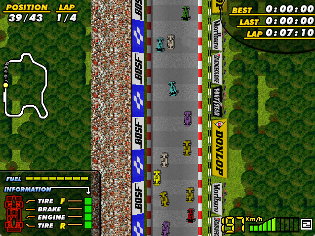

<H1 align = "center">F1 Spirit Remake </H1>

  

This repository contains an updated version of the source code for F1 Spirit, a remake of a classic game created by Konami in the 80s.

F1 Spirit was originally developed by Braingames for the 2004 Retro Remakes Competition. Competing among 73 entries, it finished in 13th place and received great reviews.

The official website of Brain Games' F1 Spirit Remake is available here:

http://f1spirit.jorito.net

## Project Goals

After so many years, the code of the game has naturally begun to show its age. F1 Spirit was originally developed using SDL 1.2 with Open GL. SDL 1.2 is now obsolete and no longer maintained. In addition, only 32-bit binaries were available, with no native builds for modern platforms such as Apple Silicon (ARM) systems.

Our goal is to refactor the source code to use SDL3, while also introducing new features, bug fixes and general improvements. 

## What's New

- Migrated the project from SDL 1.2 to SDL3, enabling modern builds and native 64-bit binaries.
- new ending sequence, with new graphics (WIP)
- Bug fixes.

## How to play

  

F-1 Spirit is a racing game. You will race with many different types of cars. Everything starts with stock cars, moving up to rally cars and Formula 3. The main goal is to finish at first place with Formula 1, the king class of racing. There are 6 types of races:

- Stock race
- Rally
- F3 race
- F3000 race
- Endurance race
- F1 races (16 tracks)

Initially, you can only race in the stock, rally and F3 races. As you win races, you will accumulate points that will allow you to play new races. If you finish a race at first place you will receive 9 points, you get 8 points if you finish second, etc. If you finish 10th or later, you will not score any points.

There are 16 different tracks for F1 cars. As you win races, you will be able to play more tracks in the F1 car category. To complete the game, you have to win all of the 16 F1 tracks. There's a grand total of 21 tracks. The first races are the easiest: the cars are slow and the enemies do not drive very well. But as you classify for new tracks the difficulty will increase: F1 cars are insanely fast! You will need a great agility to win in F1 tracks. Even though they look impossible to control at first, with some practice you can master the Formula 1 cars and win races. And if that's not enough, you can always show off your skills in multi player mode.

During a race, you can bump into other cars and into the side boards and other obstacles. This will damage your car. In every track, there is a pit lane (labeled with the letters "PIT") where you can fuel up and repair your car.

### Controls

These are the default controls of the game. They can be redefined in the options menu.

<table border=1>
<thead>
<tr>
<th align="left" width="16%">Key</th>
<th align="left" width="54%">Action</th>
<th align="left" width="30%">Info</th>
</tr>
</thead>
<tbody>
<tr><td>Cursor up</td><td>Shift up</td><td>Manual transmission only</td></tr>
<tr><td>Cursor down</td><td>Shift down</td><td>Manual transmission only</td></tr>
<tr><td>Cursor left</td><td>Steer to the left</td><td></td></tr>
<tr><td>Cursor right</td><td>Steer to the right</td><td></td></tr>
<tr><td>Space</td><td>Accelerate</td><td></td></tr>
<tr><td>M</td><td>Brake</td><td></td></tr>
<tr><td>F-1</td><td>Pause</td><td></td></tr>
<tr><td>F10 or 9</td><td>Select graphics set</td><td></td></tr>
<tr><td>ESC</td><td>Back to previous screen</td><td></td></tr>
<tr><td>ALT+ENTER</td><td>Switch between full-screen and window mode</td><td>For Windows and Linux</td></tr>
<tr><td>Apple key+F</td><td>Switch between full-screen and window mode</td><td>Only for Mac OS X</td></tr>
<tr><td>F12</td><td>Quit</td><td>For Windows and Linux</td></tr>
<tr><td>Apple key+Q</td><td>Quit</td><td>Only for Mac OS X</td></tr>
</tbody>
</table>

### Game tips

Here are some tips that will make you enjoy the game more:

- The most important one: the brake is your best friend, especially in the F1 tracks!
- Use the PIT STOPS if your car has a lot of damage. For instance your top speed will decrease if the engine is damaged. This will make you lose time in every lap.
- When you are in the PIT STOP you can hold down the DOWN key to speed up car repairs. Fuel intake will be slower, though.
- The fuel consumption is determined by the RPM meter (as in real cars). Your car only consumes fuel when you accelerate. Keep these two things in mind while you race to save fuel.
- F1 tracks cannot be won at the first race unless you are an ACE driver. To win an F1 race, try to memorize each curve and play each race several times to know where where to brake and where to accelerate.

## Credits

- Game Programming: Santi "Brain" Ontañón
- Graphics: RamonMSX, Miikka "MP83" Poikela, Maurício "Mauk" Braga, Valerian, Olivier "Picili",
          Matriax
- Music / SFX: Jorrith "Jorito" Schaap
- Additional Programming (SDL3 port, new features  and bug fixes): Maurício "Mauk" Braga
- Beta Testers: JEames, Jorito, MP83, Daedalus, Pakoto, Vampier, Chocobo2k, 
	  Silver Sword, Valerian, theNestruo, RamonMSX, Lars the 18th, Konamito,
	  AcesHigh, Kelesisv, Matriax, Ruboslav, Maurício Braga.

* Copyright © **(Brain Games)** 

## Thanks
* Jason "JEames" Eames: Web hosting
* Joram "Daedalus" van Hartingsveldt: png format reduction tools
* Lars the 18th: game font, mirroring
* Valerian: website design
* Ootini: scaned original manual of F1-Spirit
* The Retro Remakes crew, for organizing such a wonderful competition!
* Konami, for creating the original game!

## Legal Notice

This project is an unofficial remake of **Konami's F1 Spirit**, originally released in 1987 for the **MSX** home computer.

This repository is provided **"as is"**. 

All rights to the original game, its characters, graphics, music, and trademarks remain the property of Konami and their respective owners.

The Braingames team would also like to make it clear that we are not affiliated with Konami in any way other than being fans of their excellent games.

This remake is distributed free of charge and is not intended for commercial use. 

