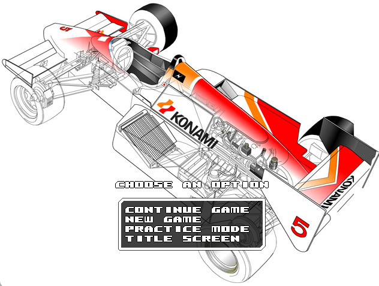

<H1 align = "center">F1 Spirit Remake </H1>

  

This repository contains an updated version of the source code for F1 Spirit, a remake of a classic game created by Konami in the 80s.

F1 Spirit was originally developed by Braingames for the 2004 Retro Remakes Competition. Competing among 73 entries, it finished in 13th place and received great reviews.

The official website of Brain Games' F1 Spirit Remake is available here:

http://f1spirit.jorito.net

## Project Goals

After so many years, the code of the game has naturally begun to show its age. F1 Spirit was originally developed using SDL 1.2 with Open GL. SDL 1.2 is now obsolete and no longer maintained. In addition, only 32-bit binaries were available, with no native builds for modern platforms such as Apple Silicon (ARM) systems.

Our goal is to refactor the source code to use SDL3, while also introducing new features, bug fixes and general improvements. 

## What's New

- Migrated the project from SDL 1.2 to SDL3, enabling modern builds and native 64-bit binaries.
- Bug fixes.

## Credits

- Game Programming: Santi "Brain" Ontañón
- Graphics: RamonMSX, Miikka "MP83" Poikela, Maurício "Mauk" Braga, Valerian, Olivier "Picili",
          Matriax
- Music / SFX: Jorrith "Jorito" Schaap
- Additional Programming (SDL3 port, new features  and bug fixes): Maurício "Mauk" Braga
- Beta Testers: JEames, Jorito, MP83, Daedalus, Pakoto, Vampier, Chocobo2k, 
	  Silver Sword, Valerian, theNestruo, RamonMSX, Lars the 18th, Konamito,
	  AcesHigh, Kelesisv, Matriax, Ruboslav, Maurício Braga.

* Copyright © **(Brain Games)** 

## Thanks
* Jason "JEames" Eames: Web hosting
* Joram "Daedalus" van Hartingsveldt: png format reduction tools
* Lars the 18th: game font, mirroring
* Valerian: website design
* Ootini: scaned original manual of F1-Spirit
* The Retro Remakes crew, for organizing such a wonderful competition!
* Konami, for creating the original game!

## Legal Notice

This project is an unofficial remake of **Konami's F1 Spirit**, originally released in 1987 for the **MSX** home computer.

This repository is provided **"as is"**. 

All rights to the original game, its characters, graphics, music, and trademarks remain the property of Konami and their respective owners.

The Braingames team would also like to make it clear that we are not affiliated with Konami in any way other than being fans of their excellent games.

This remake is distributed free of charge and is not intended for commercial use. 

